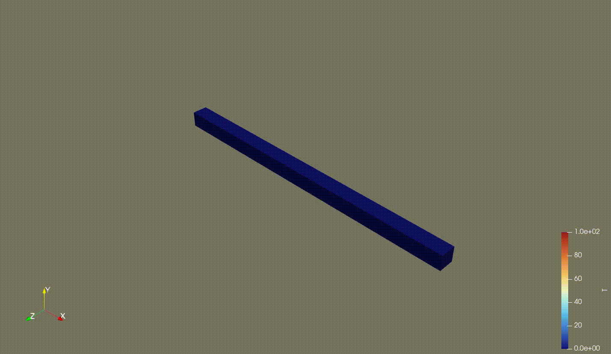
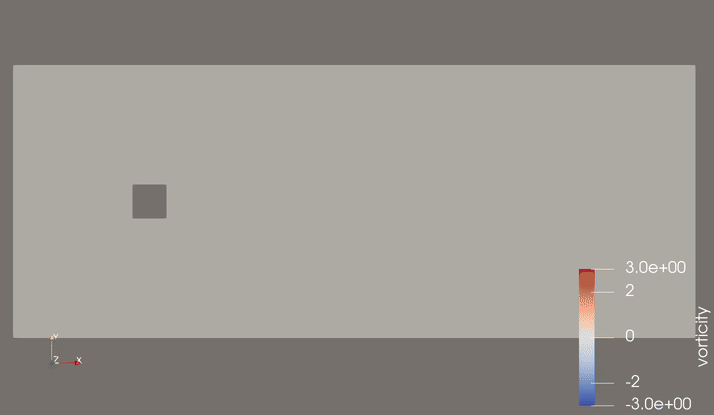

# Roque

A small finite element library for solving partial differential equations, written in Odin.

<p align="center">
  
  
</p>

_Left: a cantilever beam gets its top face heated and cooled on repeat, and bends accordingly (`demos/thermo_elastic`).
Right: a von Kármán vortex street shed from a square cylinder at Re = 100, coloured by vorticity
(`demos/vortex_street`)._

> [!NOTE]
> Roque is still in development. 

## Purpose

Roque is a tool for exploring finite element methods without many abstractions. The design aims to be general and
hackable, so a variety of physics can be explored without large amounts of library code.

We may eventually wrap Roque in an application layer, similar to a previous project, to provide convenient
configuration for common PDEs.

## Current Capabilities

Roque aims to be low-level and general-purpose, so something missing from this list isn't necessarily impossible. It
might be a trivial table addition, need a bit of extra code, or need an abstraction that doesn't fit cleanly into the
library yet.

### Elements, Spaces and Methods

| Family         | Orders | Elements                                            |
|----------------|--------|-----------------------------------------------------|
| Lagrange       | 0–3    | Line, Triangle, Quadrilateral, Tetrahedron, Hexahedron |
| Raviart–Thomas | 0–2    | Triangle, Quadrilateral, Tetrahedron, Hexahedron    |
| Nédélec        | 0–2    | Triangle, Quadrilateral, Tetrahedron, Hexahedron    |

- CG and DG
- HDG, EDG and hybrids in between.
- Any number of spaces combined into one system.

### Geometry

- Conforming 1D–3D, including embedded geometries (surfaces in 3D and the like)
- Arbitrary coordinate frames
- Graph-like meshes (e.g. truss and frame structures)
- Linear and quadratic cells
- Movable geometry: it's just coefficients, so move the nodes and carry on.

### Algebraic Constraints

- Dirichlet, including partial constraints (constrain some fields, leave others free)
- Ties: periodic boundaries, and gluing two spaces together at an interface.
- Either eliminated from the system or kept as identity rows.

> [!NOTE]
> Periodicity is defined on the mesh (via Gmsh), and tied spaces must match exactly. No hanging orders or non-matching
> meshes yet.

General multi-point constraints fall out of the constraint system naturally, but there's no friendly API for them
yet, so they're not considered supported.

### Problem Types

- Linear
- Nonlinear
- Transient: BDF1/2, θ-method, Newmark and generalized-α (no explicit methods yet)
- Eigenvalue

### Solvers and Preconditioners

| Kind             | Available                                                                 |
|------------------|---------------------------------------------------------------------------|
| Krylov           | CG, BiCGSTAB, GMRES, FGMRES                                               |
| Preconditioners  | AMG (smoothed aggregation, aggregation, Ruge–Stüben), ILU variants        |
| AMG extras       | Near null spaces (e.g. rigid body modes for elasticity)                   |

**Solvers aren't hand-rolled.** Roque links to AMGCL through custom, work-in-progress bindings, so what's available
is limited to what the bindings expose, not the full capabilities of AMGCL. Block (field-split) preconditioners
aren't built in, but custom ones can be written in Odin on top of the bindings through shell preconditioners and
operators.

### I/O

- Gmsh (version 2 binary format only, linear and quadratic)
- VTU/PVD (output only, time series included, no readers yet)

## Installation / Usage

Proper packaging will show up once the project matures. For now you need the Odin compiler and g++ (the AMGCL wrapper
is C++, AMGCL itself is vendored).

```sh
git clone https://github.com/Rwn-A/Roque.git
cd Roque
./build_amgcl.sh                                   # builds the AMGCL wrapper into build/
odin run demos/poisson -o:speed -out:build/poisson
```

That solves a small Poisson problem and writes `demos/output/poisson.vtu`, which you can open in ParaView. Run
everything from the repository root, since the demos and validation cases use paths relative to it. `-o:speed` is
recommended for anything bigger than a toy.

> [!TIP]
> `./build_amgcl.sh --openmp` builds a threaded AMGCL instead. It then needs `-define:AMGCL_OPENMP=true` on every Odin
> build (otherwise it won't link), and runs best with `OMP_WAIT_POLICY=passive` so idle OpenMP threads don't spin
> against Roque's own.

For more examples see `demos/` (the beam up top is `demos/thermo_elastic`) and `validation/` (`odin test validation`
runs them).

Everything lives in the `fe` package, with file formats in `fe/fio`. Files are prefixed by layer (`util_`, `la_`,
`form_`, `fe_`, `algo_`), and each layer only depends on the ones before it, so it reads bottom up. The AMGCL wrapper
is linked from `build/` at the repository root; if yours lives elsewhere, point at it with `-define:BUILD_DIR=<path>`.

## Validation

Ongoing.

Poisson on the unit square, u = cos(πx) sin(πy), at degrees p = 1, 2, 3 on meshes of 4 to 32 divisions. Each case
checks the L² convergence rates of u and its flux -∇u against theory, error ~ h<sup>rate</sup> (`odin test validation`
prints the tables):

| Method | Discretisation                                                    | u rate | flux rate |
|--------|-------------------------------------------------------------------|--------|-----------|
| CG     | continuous P<sub>p</sub>                                          | p + 1  | p         |
| DG     | symmetric interior penalty, discontinuous P<sub>p</sub>           | p + 1  | p         |
| HDG    | discontinuous P<sub>p</sub>, condensed onto a P<sub>p</sub> trace | p + 1  | p + 1     |
| Mixed  | Raviart–Thomas O(p-1), discontinuous P<sub>p-1</sub>              | p      | p         |

## Performance

Roque hasn't had a real optimization pass yet, but some care went into it and the design tries to avoid unnecessary
work. Threading uses a simple single-program-multiple-data model, mesh colouring keeps threads from stepping on each
other during assembly, and the solves hand off to AMGCL (optionally with OpenMP).


## Notes on AI

The purpose of this project was to write a library we understood and were happy with. As a result, AI was not used to design the core APIs or architecture. AI was used for the following:

- **AMGCL C++ bindings.** Writing C++ is old news in the year of our Lord 2026, so we let our benevolent overlords at Anthropic handle it. Its largely an exercise in wrapping template gynmastics behind runtime interfaces. 
- **Reference element table generator.** We designed the schema and the actual tables we wanted. AI wrote the Python script used to generate them. As we go to higher polynomial orders, this will eventually need some hand intervention and thoughtful design, but for now it is largely mechanical and I'd rather not spend much time on it.
- **Temporary implementation code.** AI was used for some code needed to test functionality that was too finicky or messy to write before I completely understood the problem space. Currently this consists primarily of parts of the Gmsh loader and some of the periodic boundary-condition handling. Both are provisional and will be rewritten as the library's APIs and requirements settle.

## References

**Hybridized and embedded DG**
- B. Cockburn, J. Gopalakrishnan, R. Lazarov. *Unified hybridization of discontinuous Galerkin, mixed, and continuous
  Galerkin methods for second order elliptic problems.* SIAM J. Numer. Anal. 47(2), 1319–1365, 2009.
  [doi:10.1137/070706616](https://doi.org/10.1137/070706616)
- N. C. Nguyen, J. Peraire, B. Cockburn. *An implicit high-order hybridizable discontinuous Galerkin method for linear
  convection–diffusion equations.* J. Comput. Phys. 228(9), 3232–3254, 2009.
  [doi:10.1016/j.jcp.2009.01.030](https://doi.org/10.1016/j.jcp.2009.01.030)
- N. C. Nguyen, J. Peraire, B. Cockburn. *An implicit high-order hybridizable discontinuous Galerkin method for the
  incompressible Navier–Stokes equations.* J. Comput. Phys. 230(4), 1147–1170, 2011.
  [doi:10.1016/j.jcp.2010.10.032](https://doi.org/10.1016/j.jcp.2010.10.032)
- N. C. Nguyen, J. Peraire, B. Cockburn. *A class of embedded discontinuous Galerkin methods for computational fluid
  dynamics.* J. Comput. Phys. 302, 674–692, 2015. [doi:10.1016/j.jcp.2015.09.024](https://doi.org/10.1016/j.jcp.2015.09.024)

**Solvers**
- D. Demidov. *AMGCL: An efficient, flexible, and extensible algebraic multigrid implementation.* Lobachevskii J. Math.
  40, 535–546, 2019. [doi:10.1134/S1995080219050056](https://doi.org/10.1134/S1995080219050056),
  [github.com/ddemidov/amgcl](https://github.com/ddemidov/amgcl)

**General**
- [Finite element method](https://en.wikipedia.org/wiki/Finite_element_method), Wikipedia. 
- [libCEED documentation](https://libceed.org/en/latest/), for some inspiration.
- S. Badia, F. Verdugo. *Gridap: An extensible Finite Element toolbox in Julia.* J. Open Source Softw. 5(52), 2520, 2020.
  [doi:10.21105/joss.02520](https://doi.org/10.21105/joss.02520), [Gridap.jl](https://github.com/gridap/Gridap.jl),
  also for some inspiration.
- R. Fleury. [Multi-Core By Default](https://www.dgtlgrove.com/p/multi-core-by-default), Digital Grove, 2025. The
  threading model is adapted from this.

## License

MIT, see [LICENSE](LICENSE). The vendored AMGCL is MIT licensed too.
